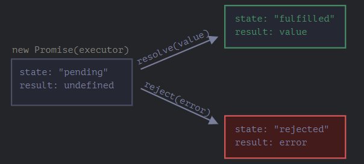
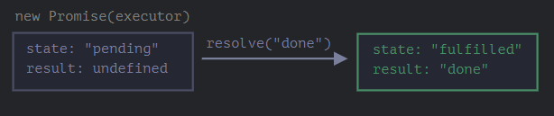
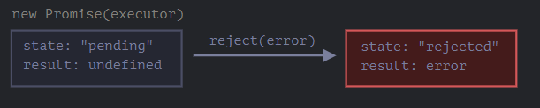

# JavaScript Talk

In this repository, I will be talking about JavaScript and its features. I will be covering the following topics:

## Table of contents

- [Data types in JavaScript](#Data-types-in-JavaScript)
  - [Primitive Data Types](#Primitive-Data-Types)
  - [Non-Primitive Data Types](#Non-Primitive-Data-Types)
  - [Characteristics of Primitive Data Types VS Non-Primitive Data Types](#Characteristics-of-Primitive-Data-Types-VS-Non-Primitive-Data-Types)
- [Declaring Objects in JS](#Declaring-Objects-in-JS)
  - [1. Object Literal](#1-object-literal)
  - [2. Object Constructor](#2-object-constructor)
  - [3. Object.create()](#3-objectcreate)
  - [4.0 Prototype Chain](#40-prototype-chain)
  - [4.1 Function Constructor](#41-function-constructor)
  - [4.2 Adding Methods to the Prototype](#42-adding-methods-to-the-prototype)
  - [5. ES6 Classes](#5-es6-classes)
- [Copy Objects in JS](#Copy-Objects-in-JS)
  - [1. Shallow Copy](#1-shallow-copy)
  - [2. Deep Copy](#2-deep-copy)
- [Other examples to use Spread Operator](#other-examples-to-use-spread-operator)
- [Declaring Functions in js](#Declaring-Functions-in-js)
- [Types of functions in JS](#Types-of-functions-in-JS)
- [Functions are First Class Objects](#Functions-are-First-Class-Objects)
- [JS is single-threaded programming language](#JS-is-single-threaded-programming-language)
- [Callback Functions](#Callback-Functions)
- [Higher Order Functions](#Higher-Order-Functions)
- [Promises in js](#Promises-in-js)
- [Promises (then() Catch() finally())](#Promises-then-Catch-finally)
- [Fetch()](#Fetch)
- [Async](#Async)
- [Await](#Await)
- [Callback Hell and how to avoid it](#Callback-Hell-and-how-to-avoid-it)

---

## Data types in JavaScript

Examples of primitive and non-primitive data types in JavaScript:

- **Primitive data types**
- **Non-primitive data types**

### **Primitive Data types VS Non-Primitive Data Types**

| Primitive Data Types | Non-Primitive Data Types |
| :------------------: | :----------------------: |
|        String        |          Object          |
|        Number        |          Array           |
|       Boolean        |         Function         |
|         Null         |           Date           |
|      Undefined       |           Set            |
|        Symbol        |           Map            |

### Primitive Data Types

1. **Boolean**: A boolean represents a logical value of either `true` or `false`.

   ```javascript
   let isRaining = true; // boolean value
   console.log(typeof isRaining); // "boolean"
   ```

2. **Number**: A number represents a numeric value, including integers and floating-point numbers.

   ```javascript
   let age = 30; // integer
   let price = 9.99; // floating-point number
   console.log(typeof age); // "number"
   console.log(typeof price); // "number"
   ```

3. **String**: A string represents a sequence of characters.

   ```javascript
   let message = "Hello, world!"; // string
   console.log(typeof message); // "string"
   ```

4. **Undefined**: A variable that has been declared but has not been assigned a value is `undefined`.

   ```javascript
   let firstName; // undefined
   console.log(typeof firstName); // "undefined"
   ```

5. **Null**: A variable that is explicitly assigned the value `null` represents an intentional absence of any object value.

   ```javascript
   let middleName = null; // null
   console.log(typeof middleName); // "object"
   ```

6. **Symbol**: A symbol represents a unique identifier.

   ```javascript
   const id = Symbol("id"); // symbol
   console.log(typeof id); // "symbol"
   ```

### Non-Primitive Data Types

1. **Object**: An object is a collection of key-value pairs and represents a complex entity or data structure.

   ```javascript
   const person = {
     firstName: "John",
     lastName: "Doe",
     age: 30,
     hobbies: ["reading", "coding", "traveling"],
   }; // object
   console.log(typeof person); // "object"
   ```

2. **Array**: An array is an ordered list of values.

   ```javascript
   const numbers = [1, 2, 3, 4, 5]; // array
   console.log(typeof numbers); // "object"
   ```

3. **Function**: A function is a reusable block of code that performs a specific task.

   ```javascript
   function greet(name) {
     console.log(`Hello, ${name}!`);
   }

   greet("Alice"); // logs "Hello, Alice!"
   greet("Bob"); // logs "Hello, Bob!"
   ```

4. **Date**: A date represents a specific moment in time.

   ```javascript
   const now = new Date(); // current date and time
   console.log(typeof now); // "object"
   ```

5. **Set**: A set is a collection of unique values.

   ```javascript
   const set = new Set([1, 2, 3, 4, 5]); // set
   console.log(typeof set); // "object"
   ```

6. **Map**: A map is a collection of key-value pairs.

   ```js
   const map1 = new Map();

   map1.set("a", 1);
   map1.set("b", 2);
   map1.set("c", 3);

   console.log(map1.get("a"));
   // Expected output: 1

   map1.set("a", 97);

   console.log(map1.get("a"));
   // Expected output: 97

   console.log(map1.size);
   // Expected output: 3

   map1.delete("b");

   console.log(map1.size);
   // Expected output: 2
   ```

   ```javascript
   const map = new Map([
     ["a", 1],
     ["b", 2],
     ["c", 3],
   ]); // map
   console.log(map); // Map(3) {"a" => 1, "b" => 2, "c" => 3}
   console.log(typeof map); // "object"
   ```

### **Characteristics of Primitive Data Types VS Non-Primitive Data Types**

<div style="margin-left: 30px;">

| Primitive Data Types | Non-Primitive Data Types |
| :------------------: | :----------------------: |
|      Immutable       |         Mutable          |
|   Passed by value    |   Passed by reference    |
|   Stored in stack    |      Stored in heap      |
|   Copied by value    |   Copied by reference    |
|  Compared by value   |  Compared by reference   |
|  Accessed by value   |  Accessed by reference   |

</div>

### Examples on characteristics of Primitive Data Types VS Non-Primitive Data Types

- Here are some code examples to illustrate the differences between primitive data types and non-primitive data types in JavaScript:

1. **Immutable vs Mutable**

   Primitive data types are immutable, meaning their value cannot be changed after they are created:

   ```javascript
   let a = "Hello";
   a[0] = "J"; // This has no effect, a remains "Hello"
   console.log(a); // Output: "Hello"
   ```

   Non-primitive data types are mutable, meaning their values can be changed after they are created:

   ```javascript
   let obj = { name: "John" };
   obj.name = "Jane"; // Changes the value of the 'name' property
   console.log(obj); // Output: {name: "Jane"}
   ```

2. **Passed by value vs Passed by reference**

   Primitive data types are passed by value, meaning a copy of their value is passed to a function:

   ```javascript
   function changeValue(a) {
     a = 10;
   }

   let x = 5;
   changeValue(x);
   console.log(x); // Output: 5
   ```

   Non-primitive data types are passed by reference, meaning a reference to their memory location is passed to a function:

   ```javascript
   function changeValue(obj) {
     obj.name = "Jane";
   }

   let person = { name: "John" };
   changeValue(person);
   console.log(person); // Output: {name: "Jane"}
   ```

3. **Stored in stack vs Stored in heap**

   Primitive data types are stored in the stack:

   ```javascript
   let a = 5;
   ```

   Non-primitive data types are stored in the heap:

   ```javascript
   let obj = { name: "John" };
   ```

4. **Copied by value vs Copied by reference**

   Primitive data types are copied by value:

   ```javascript
   let a = 5;
   let b = a; // Copies the value of a to b
   b = 10;
   console.log(a); // Output: 5
   ```

   Non-primitive data types are copied by reference:

   ```javascript
   let obj1 = { name: "John" };
   let obj2 = obj1; // Copies the reference to obj1 to obj2
   obj2.name = "Jane";
   console.log(obj1); // Output: {name: "Jane"}
   ```

5. **Compared by value vs Compared by reference**

   Primitive data types are compared by value:

   ```javascript
   let a = 5;
   let b = 5;
   console.log(a === b); // Output: true
   ```

   Non-primitive data types are compared by reference:

   ```javascript
   let obj1 = { name: "John" };
   let obj2 = { name: "John" };
   console.log(obj1 === obj2); // Output: false
   ```

6. **Accessed by value vs Accessed by reference**

   Primitive data types are accessed by value:

   ```javascript
   let a = 5;
   let b = a; // Copies the value of a to b
   b = 10;
   console.log(a); // Output: 5
   ```

   Non-primitive data types are accessed by reference:

   ```javascript
   let obj = { name: "John" };
   console.log(obj.name); // Output: "John"
   ```

---

## Declaring Objects in JS

In JavaScript, there are multiple ways to declare an object. Here are some common methods:

### 1. Object Literal

The most common way to create an object in JavaScript is to use an object literal. This is simply a comma-separated list of name-value pairs inside curly braces.

```javascript
const person = {
  name: "John",
  age: 30,
  address: {
    street: "123 Main St",
    city: "Anytown",
    state: "CA",
    zip: "12345",
  },
};
```

### 2. Object Constructor

Another way to create an object is to use the Object constructor. This method creates an empty object, which you can then add properties and methods to using dot notation.

```javascript
const person = new Object();
person.name = "John";
person.age = 30;
person.address = {
  street: "123 Main St",
  city: "Anytown",
  state: "CA",
  zip: "12345",
};
```

### 3. Object.create()

The Object.create() method creates a new object, using an existing object as the prototype. This method allows you to create an object with a specific prototype, which can be useful for inheritance.

```javascript
const personProto = {
  greeting: function () {
    console.log("Hello, my name is " + this.name);
  },
};

const person = Object.create(personProto);
person.name = "John";
person.age = 30;
```

### 4.0 Prototype Chain

- `Prototype chain` is a feature of JavaScript that allows objects to inherit properties and methods from other objects.
- In JavaScript, every object has a `prototype` object, which is essentially another object from which the first object inherits properties and methods.
- When a property or method is called on an object, JavaScript first looks for that property or method on the object itself.
- If the property or method is not found, JavaScript then looks for it on the object's prototype.
- If it is not found there, JavaScript looks on the prototype's prototype, and so on, creating a `chain of objects` until the property or method is found or there is no further prototype to search.

- Here is an example of prototype chain in JavaScript:

  ```js
  // Create an object
  const myObj = {
    a: 1,
  };

  // Create another object that inherits from myObj
  const myOtherObj = Object.create(myObj);
  myOtherObj.b = 2;

  // Add a property to myObj's prototype
  myObj.prototype.c = 3;

  // Call a method on myOtherObj
  console.log(myOtherObj.a); // Output: 1

  // Call a method on myOtherObj that is not defined on it
  console.log(myOtherObj.c); // Output: 3
  ```

- In this example, we first create an object `myObj` with a property `a` equal to `1`. We then create another object `myOtherObj` using `Object.create(myObj)`, which sets `myOtherObj`'s prototype to `myObj`. We also give `myOtherObj` its own property `b` equal to `2`.

- Next, we add a property `c` to `myObj`'s prototype object by using the `.prototype` syntax. This means that `c` is now a property of `myObj`'s prototype, and therefore all objects that inherit from `myObj` will also have access to `c`.

- Finally, we call `console.log(myOtherObj.a)`, which logs the value of `myOtherObj.a` to the console. Since `myOtherObj` inherits from `myObj`, it has access to the `a` property defined on `myObj`, so the output is `1`. We then call `console.log(myOtherObj.c)`, which logs the value of `myOtherObj.c` to the console. `myOtherObj` does not have its own `c` property, so JavaScript looks for `c` on `myOtherObj`'s prototype object (which is `myObj`), and finds it there. Therefore, the output is `3`.

- This example demonstrates the basics of prototype chain in JavaScript. By using prototype inheritance, we can create complex object hierarchies and easily share properties and methods between objects.

### 4.1 Function Constructor

In JavaScript, a function constructor is a function that is used to create objects.

- A function constructor is defined using the `function` keyword, and it is conventionally named with an initial `uppercase` letter to differentiate it from regular functions.
- The function constructor is called with the `new` keyword to create new objects.

- Here's an example:

  ```js
  // Function constructor
  function Person(name, age) {
    this.name = name;
    this.age = age;
  }

  // Creating objects using the function constructor
  const person1 = new Person("John", 30);
  const person2 = new Person("Jane", 25);

  // Accessing the properties of the objects
  console.log(person1.name); // Output: "John"
  console.log(person2.age); // Output: 25
  ```

- In the example above, we define a function constructor `Person` that takes two parameters, `name` and `age`. When the function constructor is called with the `new` keyword, it creates a new object and sets the `name` and `age` properties on the object using the `this` keyword.

- We create two objects `person1` and `person2` using the `Person` function constructor and access their properties using dot notation.

- Function constructors can be useful for creating multiple objects with similar properties and methods. By defining a function constructor, we can create objects with the same set of properties and methods without duplicating code. We can also add methods to the prototype object of the function constructor to allow all objects created by the constructor to inherit those methods.

### 4.2 Adding Methods to the Prototype

- In JavaScript, you can add methods to a function constructor by adding them to the `prototype` property of the constructor function.

- Here's an example:

  ```js
  // Function constructor
  function Person(name, age) {
    this.name = name;
    this.age = age;
  }

  // Adding a method to the prototype object of the function constructor
  Person.prototype.greet = function () {
    console.log("Hello, my name is " + this.name);
  };

  // Creating an object using the function constructor
  const person1 = new Person("John", 30);

  // Calling the method added to the prototype object
  person1.greet(); // Output: "Hello, my name is John"
  ```

- In this example, we define a function constructor `Person` and add a `greet` method to its prototype object. The `greet` method uses the `this` keyword to refer to the current object and logs a greeting to the console.

- When we create a new object `person1` using the `Person` function constructor, the `[[Prototype]]` of the object is set to the `Person.prototype` object, so the `greet` method is available on the object. We call the `greet` method on `person1`, and it logs a greeting to the console.

- Adding methods to the prototype object of a function constructor allows all objects created by the constructor to inherit those methods. This can be more memory-efficient than adding methods directly to each object, as the methods are shared among all objects created by the constructor.

### 4.3.1 What happen when we call a `function constructor` without the `new` keyword in js?

- When a function constructor is called without the `new` keyword in JavaScript, it does not create a new object to serve as the `this` value for the function. Instead, the function will execute in the global context (i.e., the `window` object in the browser or the `global` object in Node.js) and any properties or methods that are defined within the function will be added to the global object.

- For example, consider the following function constructor:

  ```js
  function Person(name, age) {
    this.name = name;
    this.age = age;
  }
  ```

- If you call this constructor with the `new` keyword like this:

  ```js
  const person1 = new Person("John", 30);
  ```

- A new object will be created and `this` will refer to that object. `person1` will be an instance of the `Person` object with its own `name` and `age` properties.

- However, if you call the constructor without the `new` keyword like this:

  ```js
  const person2 = Person("Jane", 25);
  ```

- The function will execute in the global context and `this` will refer to the global object. The `name` and `age` properties will be added to the global object instead of a new object. `person2` will be undefined, since the function does not return anything explicitly.

- It's generally considered a best practice to always use the `new` keyword when calling function constructors in JavaScript to avoid unintended side effects and to ensure that the `this` value is set correctly.

### 4.3.2 How to make sure that the `new` keyword is used to call the `function constructor`?

- To ensure that the new keyword is used when calling a function constructor in JavaScript, you can use the following technique:
- You can use the `new.target` meta property to check if the new keyword is used when calling a function constructor in JavaScript.
- The `new.target` property is available inside a function constructor and its value will be a reference to the constructor function that was called with the `new` keyword.
- If the function is called without the `new` keyword, `new.target` will be `undefined`.

- Here's an example of how you can use `new.target` to check if the `new` keyword is used:

  ```js
  function Person(name, age) {
    // Check if the function is called with the new keyword
    if (!new.target) {
      return new Person(name, age);
    }

    // Otherwise, continue with the normal constructor logic
    this.name = name;
    this.age = age;
  }
  ```

### 4.4 Excersise on Function Constructor

### 4.4.1 Excersise 1

- Create a `Car` function constructor that takes three parameters: `make`, `model`, and `year`.
- The function constructor should set these properties on the object created by it.
- Add a method to the Car function constructor's prototype object called `start()`. This method should log a message to the console indicating that the car has started.
- Add a method to the Car function constructor's prototype object called `stop()`. This method should log a message to the console indicating that the car has stopped.
- Create two Car objects and call their `start()` and `stop()` methods.
- Here's some example code to get you started:

  ```js
  const car1 = new Car("Toyota", "Corolla", 2020);
  const car2 = new Car("Honda", "Civic", 2019);

  car1.start(); // Output: "The Toyota Corolla has started."
  car2.start(); // Output: "The Honda Civic has started."
  ```

### 4.4.2 Excersise 2

- Create a `BankAccount` function constructor that takes one parameter: `balance`.
- The function constructor should set the balance property on the object created by it.

- Add three methods to the BankAccount function constructor's prototype object: `deposit()`, `withdraw()`, and `getBalance()`.

- The `deposit()` method should take a parameter `amount` and add it to the `balance` property.

- The `withdraw()` method should take a parameter `amount` and subtract it from the `balance` property.

- The `getBalance()` method should `return` the current `balance`.

- Create a `BankAccount` object and call its` deposit()`, `withdraw()`, and `getBalance()` methods.
- Here's some example code to get you started:

  ```js
  const account = new BankAccount(1000);

  console.log(account.getBalance()); // Output: 1000

  account.deposit(500);
  console.log(account.getBalance()); // Output: 1500

  account.withdraw(200);
  console.log(account.getBalance()); // Output: 1300
  ```

### 5. ES6 Classes

ES6 introduced the class syntax, which provides a more traditional object-oriented programming approach to creating objects.

```javascript
class Person {
  constructor(name, age) {
    this.name = name;
    this.age = age;
  }

  greeting() {
    console.log("Hello, my name is " + this.name);
  }
}

const person = new Person("John", 30);
```

These are some of the common ways to declare objects in JavaScript. Depending on your use case, one method may be more appropriate than the others.

---

## Copy Objects in JS

In JavaScript, objects are non-primitive data types and are stored in the heap. When an object is assigned to a variable or passed as an argument to a function, a reference to its memory location is copied, not a copy of its value.

There are two ways to create a copy of an object:

- `Shallow Copy`
- `Deep Copy`

### 1. Shallow copy

- Shallow copy creates a new object that shares the same memory references as the original object for its properties.
- This means that if the property value is an object, the new object will reference the same memory location as the original object.
- Shallow copy is achieved through the `Object.assign()` method or the `spread operator (ES6)`.

  - Here's an example of shallow copying an object using `Object.assign()`:

    ```javascript
    let originalObj = {
      name: "John",
      age: 30,
      address: {
        street: "123 Main St",
        city: "Anytown",
        state: "CA",
      },
    };

    let newObj = Object.assign({}, originalObj);

    console.log(newObj); // Output: {name: "John", age: 30, address: {street: "123 Main St", city: "Anytown", state: "CA"}}
    console.log(originalObj === newObj); // Output: false
    console.log(originalObj.address === newObj.address); // Output: true
    ```

    As you can see, the `newObj` is a shallow copy of `originalObj`. `newObj` has its own memory space, but the "`address`" property of `newObj` references the same memory location as the "`address`" property of `originalObj`.

  - Here's an example of `shallow` copying an object using the `spread operator`:

    ```js
    let originalObj = {
      name: "John",
      age: 30,
      address: {
        street: "123 Main St",
        city: "Anytown",
        state: "CA",
      },
    };

    let newObj = { ...originalObj };

    console.log(newObj); // Output: {name: "John", age: 30, address: {street: "123 Main St", city: "Anytown", state: "CA"}}
    console.log(originalObj === newObj); // Output: false
    console.log(originalObj.address === newObj.address); // Output: true
    ```

    As you can see, the `newObj` is a shallow copy of `originalObj`. `newObj` has its own memory space, but the "`address`" property of `newObj` references the same memory location as the "`address`" property of originalObj.

### 2. Deep copy

- `Deep copy`, on the other hand, creates a completely new object with its own memory space for all properties, including those that are objects themselves.
- This ensures that changes made to the copied object `do not affect` the original object or any other copies of the object.

- There are different ways to achieve `deep copy`, one of which is using the `JSON.parse()` and `JSON.stringify()` methods.
- The `JSON.parse()` and `JSON.stringify()` methods can be used to copy an object, creating a deep copy. This method works by first serializing the original object to a JSON string using `JSON.stringify()`, and then deserializing the JSON string back into an object using `JSON.parse()`.

  - Here's an example of deep copying an object using `JSON.parse()` and `JSON.stringify()`:

    ```javascript
    let originalObj = {
      name: "John",
      age: 30,
      address: {
        street: "123 Main St",
        city: "Anytown",
        state: "CA",
      },
    };

    let newObj = JSON.parse(JSON.stringify(originalObj));

    console.log(newObj); // Output: {name: "John", age: 30, address: {street: "123 Main St", city: "Anytown", state: "CA"}}
    console.log(originalObj === newObj); // Output: false
    console.log(originalObj.address === newObj.address); // Output: false
    ```

    As you can see, `newObj` is a deep copy of `originalObj`. `newObj` has its own memory space for all properties, including the "`address`" property. Therefore, changes made to `newObj` will not affect the `originalObj` or any other copies of the object.

    \*\*\*Note that using `JSON.parse()` and `JSON.stringify()` may not work for all cases, such as when the object contains `functions` or `symbols`. In those cases, other methods of deep copying may be necessary.

---

## Other examples to use Spread Operator:

- The spread operator is a new addition to the set of operators in JavaScript ES6. It takes in an iterable (e.g an array) and expands it into individual elements.
- The spread operator is commonly used to make shallow copies of JS objects. Using this operator makes the code concise and enhances its readability.
- Examples with Arrays:

  ```js
  const arr = [1, 2, 3];
  console.log(...arr);
  ```

  ```js
  const arr = [1, 2, 3];
  const arr2 = [4, 5, 6];
  const arr3 = [...arr, ...arr2];
  console.log(arr3);
  ```

  ```js
  const arr = [1, 2, 3];
  const arr2 = [...arr, 4, 5, 6];
  console.log(arr2);
  ```

  - Example with Objects:

  ```js
  const person = { name: "John", age: 30 };
  const clone = { ...person };
  console.log(clone);
  ```

  ```js
  const person = { name: "John", age: 30 };
  const clone = { ...person, location: "USA" };
  console.log(clone);
  ```

  ```js
  const person = { name: "John", age: 30 };
  const clone = { location: "USA", ...person };
  console.log(clone);
  ```

  ```js
  const person = { name: "John", age: 30 };
  const clone = { ...person, age: 40 };
  console.log(clone);
  ```

  ```js
  const person = { firstName: "John", lastName: "Doe", age: 30 };
  const address = { city: "New York", state: "NY", zip: "10001" };

  const user = { ...person, ...address };

  console.log(user);
  ```

---

## Declaring Functions in js

In JavaScript, there are several ways to declare functions. Here are some of the most common ones:

1. **`Function Declaration`**: This is the most common way to declare a function. It uses the "`function`" keyword followed by the function name, parameters, and function body.

   ```javascript
   function functionName(parameter1, parameter2) {
     // function body
     return something;
   }
   ```

2. **`Function Expression`**: In this method, you declare a function as a variable and `assign` it a value using the "function" keyword.

   ```javascript
   var functionName = function (parameter1, parameter2) {
     // function body
     return something;
   };
   ```

3. **`Arrow Function`**: This is a new way to declare functions in ES6 (ECMAScript 2015). Arrow functions are shorter and have a more concise syntax compared to regular functions.

   ```javascript
   var functionName = (parameter1, parameter2) => {
     // function body
     return something;
   };

   var functionName = parameter1 => {
     // function body to do something and then return something
     return something;
   };

    var functionName = (parameter1, parameter2) => return something;


   var functionName = parameter1 => return something;
   ```

4. **`Method Definition`**: This is used to declare a function as a `property` of an `object`.
   ```js
   var obj = {
     functionName: function (parameter1, parameter2) {
       // function body
       return something;
     },
   };
   ```

---

## Types of functions in JS

Some examples of different types of functions in JavaScript based on their behavior and side-effects:

1. **Pure function**:

   A pure function is a function that doesn't modify any data outside of its own scope and always returns the same result for the same input. Here is an example:

   ```javascript
   function add(a, b) {
     return a + b;
   }
   ```

2. **Impure function**:

   An impure function is a function that modifies data outside of its own scope or has side effects. Here is an example:

   ```javascript
   let count = 0;

   function incrementCount() {
     count++;
   }
   ```

3. **Higher-order function**:

   A higher-order function is a function that takes one or more functions as arguments or returns a function as its result. Here is an example:

   ```javascript
   function multiplyBy(num) {
     return function (x) {
       return x * num;
     };
   }

   const double = multiplyBy(2);
   console.log(double(5)); // Output: 10
   ```

4. **Recursive function**:

   A recursive function is a function that calls itself until a certain condition is met. Here is an example:

   ```javascript
   function factorial(num) {
     if (num === 0 || num === 1) {
       return 1;
     }
     return num * factorial(num - 1);
   }

   console.log(factorial(5)); // Output: 120
   ```

5. **Arrow function**:

   An arrow function is a more concise syntax for writing a function in JavaScript. Here is an example:

   ```javascript
   const add = (a, b) => {
     return a + b;
   };

   console.log(add(2, 3)); // Output: 5
   ```

6. **Generator function**:

   A generator function is a function that can pause its execution and return multiple values one at a time. Here is an example:

   ```javascript
   function* processNumbers(numbers) {
     for (const num of numbers) {
       // Perform some operation on num
       const result = num * 2;

       // Pause the iteration and yield the result
       yield result;
     }
   }

   function doSomething() {
     console.log("Doing something...");
   }

   const numbers = [1, 2, 3, 4, 5];
   const gen = processNumbers(numbers);

   // Iterate over the generator and pause after each result
   console.log(gen.next().value); // 2
   doSomething();
   console.log(gen.next().value); // 4
   doSomething();
   console.log(gen.next().value); // 6
   doSomething();
   console.log(gen.next().value); // 8
   doSomething();
   console.log(gen.next().value); // 10
   ```

---

## Functions are First Class Objects

- In javaScript functions are considered first-class objects, which means they can be treated like any other value or object. This means that:

  - **Functions can be assigned to variables**:

    ```js
    const add = function (a, b) {
      return a + b;
    };
    console.log(add(2, 3)); // 5
    ```

  - **Functions can be returned as values from functions**:

    ```js
    function multiply(x, y) {
      return x * y;
    }

    // multiply 3,4,5, by 2
    multiply(2, 3); //6
    multiply(2, 4); // 8
    multiply(2, 5); // 10

    // multiply 3,4,5, by 3
    multiply(3, 3); // 9
    multiply(3, 4); // 12
    multiply(3, 5); // 15
    ```

    ```js
    function multiplyByTwo(x) {
      return x * 2;
    }

    function multiplyByThree(x) {
      return x * 3;
    }

    function multiplyByFour(x) {
      return x * 4;
    }
    ```

    ```js
    function makeMultiplier(factor) {
      return function (number) {
        return number * factor;
      };
    }

    const multiplyByTwo = makeMultiplier(2);

    // multiply 3,4,5, by 2
    console.log(multiplyByTwo(3)); // 6
    console.log(multiplyByTwo(4)); // 8
    console.log(multiplyByTwo(5)); // 10

    const multiplyByThree = makeMultiplier(3);
    // multiply 3,4,5, by 3
    console.log(multiplyByThree(3)); // 9
    console.log(multiplyByThree(4)); // 12
    console.log(multiplyByThree(5)); // 15
    ```

    - When a function returns another function as its result, it is called a "`closure`".
    - A `closure` is a function that has access to variables in its outer (enclosing) scope, even after the outer function has returned.

  - **Functions can be stored in data structures like arrays or objects**:

    ```js
    const operations = {
      add: function (a, b) {
        return a + b;
      },
      subtract: function (a, b) {
        return a - b;
      },
      multiply: function (a, b) {
        return a * b;
      },
      divide: function (a, b) {
        return a / b;
      },
    };

    console.log(operations.add(2, 3)); // 5
    console.log(operations.divide(10, 2)); // 5
    ```

  - **Functions can be passed as arguments to other functions**:

    ```js
    function greeting(name) {
      console.log(`Hello, ${name}!`);
    }

    function greetingWrapper(fn, name) {
      console.log("Preparing to greet...");
      fn(name);
      console.log("Greeting complete.");
    }

    greetingWrapper(greeting, "Alice");

    // Output:
    // Preparing to greet...
    // Hello, Alice!
    // Greeting complete.
    ```

---

## JS is single-threaded programming language

- JS is `single-threaded` programming language, which means it can only execute one task at a time.
- This is because it has only one `call stack`, which is responsible for executing the code.
- This means that if a function is currently executing, no other code can run until the call stack is clear.
- This can be a problem if a function takes a long time to execute, because it will block the call stack and prevent other code from running. This is known as `blocking code`.
- Blocking code can be a problem in JavaScript because it can make the user interface unresponsive.
- For example, if a function takes a long time to execute, the user will not be able to interact with the page until the function is finished executing.
- This can be a problem if the function is doing something that is not related to the user interface, such as fetching data from a server or performing a complex calculation.
- To solve this problem, JavaScript developers often use `asynchronous programming techniques`, such as `callbacks`, `promises`, and `async/await`, to allow the application to continue running while it waits for long-running tasks to complete.
- This allows the user interface to remain responsive while the application is performing long-running tasks.

---

## Callback Functions

- A callback is a function that is passed as an argument to another function
- And is executed after some operation has been completed

### Challenges solved by callback function in js:

#### 1. Code duplication

- Example to show the problem without callback function:

  ```js
  // breaking the DRY principle

  const nums = [1, 2, 3, 4, 5, 6, 7, 8, 9, 10];
  console.log(nums);

  function copyArrayAndMultiplyByTwo(array) {
    const output = [];
    for (let i = 0; i < array.length; i++) {
      output.push(array[i] * 2);
    }
    return output;
  }
  const numbers1 = copyArrayAndMultiplyByTwo(nums); // [2, 4, 6, 8, 10, 12, 14, 16, 18, 20]

  function copyArrayAndDivideByTwo(array) {
    const output = [];
    for (let i = 0; i < array.length; i++) {
      output.push(array[i] / 2);
    }
    return output;
  }
  const numbers2 = copyArrayAndDivideByTwo(nums); // [0.5, 1, 1.5, 2, 2.5, 3, 3.5, 4, 4.5, 5]

  function copyArrayAndAddTwo(array) {
    const output = [];
    for (let i = 0; i < array.length; i++) {
      output.push(array[i] + 2);
    }
    return output;
  }
  const numbers3 = copyArrayAndAddTwo(nums); // [3, 4, 5, 6, 7, 8, 9, 10, 11, 12]
  ```

- The solution using callback function

  ```js
  // using the callback functions:
  function multiplyByTwo(number) {
    return number * 2;
  }

  function divideByTwo(number) {
    return number / 2;
  }

  function addTwo(number) {
    return number + 2;
  }

  function copyArray(array, instructions) {
    const newArray = [];
    array.forEach((element) => {
      newArray.push(instructions(element));
    });
    return newArray;
  }

  const numbers = [1, 2, 3, 4, 5, 6, 7, 8, 9, 10];
  console.log(numbers); // [1, 2, 3, 4, 5, 6, 7, 8, 9, 10]

  const newNumbers = copyArray(numbers, multiplyByTwo);
  console.log(newNumbers); // [2, 4, 6, 8, 10, 12, 14, 16, 18, 20]

  const newNumbers2 = copyArray(numbers, divideByTwo);
  console.log(newNumbers2); // [0.5, 1, 1.5, 2, 2.5, 3, 3.5, 4, 4.5, 5]

  const newNumbers3 = copyArray(numbers, addTwo);
  console.log(newNumbers3); // [3, 4, 5, 6, 7, 8, 9, 10, 11, 12]
  ```

  - You don't need to create a new function for each operation
  - You can pass a annonymous/arrow function as an argument to another function

  ```js
  // Passing annonymous function as arguments to another function
  const newNumbers4 = copyArray(numbers, function (number) {
    return number + 2;
  });
  console.log(newNumbers4); // [3, 4, 5, 6, 7, 8, 9, 10, 11, 12]

  // Passing arrow function as arguments to another function
  const newNumbers5 = copyArray(numbers, (number) => number + 2);
  console.log(newNumbers5); // [3, 4, 5, 6, 7, 8, 9, 10, 11, 12]
  ```

#### 2. Callback function to handle events in the browser

- Example to show how to use callback function to handle events in the browser

  ```js
  const button = document.querySelector("button");

  function handleClick(event) {
    console.log("Button clicked!");
  }

  button.addEventListener("click", handleClick);
  ```

#### 3. Asynchronous programming

- In asynchronous programming, a function may take some time to complete its operation. This can cause the program to pause or become unresponsive.
- Callbacks provide a way to avoid this by allowing the program to continue executing while the asynchronous function is running in the background.

  ```js
  function getData(callback) {
    setTimeout(() => {
      const data = { name: "John Doe", age: 30 };
      callback(data);
    }, 1000);
  }

  function processData(data) {
    console.log(`Name: ${data.name}, Age: ${data.age}`);
  }

  getData(processData); // Output after 1 second: Name: John Doe, Age: 30
  ```

- The above example shows how callbacks can be used to handle asynchronous operations in JavaScript.
- The `getData()` function takes a callback function as an argument and executes it after one second.
- The `processData()` function is passed as an argument to the `getData()` function and is executed after one second.
- The `processData()` function receives the data object as an argument and logs it to the console.
- The `getData()` function is called with the `processData()` function as an argument.
- The `getData()` function executes the `processData()` function after one second and passes the data object as an argument.

---

## Higher Order Functions

- **Higher order function** is a function that takes a function as an argument

  ```js
  function copyArray(array, instructions) {
    const newArray = [];
    array.forEach((element) => {
      newArray.push(instructions(element));
    });
    return newArray;
  }

  function multiplyByTwo(number) {
    return number * 2;
  }

  const numbers = [1, 2, 3, 4, 5, 6, 7, 8, 9, 10];

  // Using the higher-order function to pass a function as an argument

  const newNumbers = copyArray(numbers, multiplyByTwo);
  console.log(newNumbers); // [2, 4, 6, 8, 10, 12, 14, 16, 18, 20]
  ```

- Or a function that returns a function as a result

  ```js
  // example of a function that returns a function as a result:
  function createAdder(num) {
    return function (x) {
      return x + num;
    };
  }
  const addTwo = createAdder(2);
  console.log(addTwo(10)); // 12

  const addFive = createAdder(5);
  console.log(addFive(10)); // 15
  ```

---

## JS built-in HOF

**Examples of built-in higher-order functions in JavaScript**:

1. **`Array.map()`**: Returns a new array with the same number of elements as the original array, where each element is transformed according to a function that is passed as an argument.

   ```js
   const numbers = [1, 2, 3, 4, 5];

   const doubledNumbers = numbers.map(function (num) {
     return num * 2;
   });

   console.log(doubledNumbers); // Output: [2, 4, 6, 8, 10]
   ```

2. **`Array.filter()`**: Returns a new array with only the elements that pass a test implemented by a function that is passed as an argument.

   ```js
   const numbers = [1, 2, 3, 4, 5];

   const evenNumbers = numbers.filter(function (num) {
     return num % 2 === 0;
   });

   console.log(evenNumbers); // Output: [2, 4]
   ```

3. **`Array.reduce()`**:

- The goal of the `reduce` method is to reduce the array to a single value by applying a function to each element in that array (from left to right).
- The function that is passed to `reduce()` takes two arguments: an `accumulator` and the `current value` in the array.
- The function returns the updated `accumulator`, which is used as the `accumulator` for the next iteration.
- The function is called once for each element in the array.
  <br/><br/>

  ```js
  const numbers = [1, 2, 3, 4, 5];

  const sumOfNumbers = numbers.reduce(function (acc, num) {
    return acc + num;
  }, 0);

  console.log(sumOfNumbers); // Output: 15
  ```

-  These built-in higher-order functions make it easy to write concise and expressive code that manipulates arrays.

## Promises in js

- `Promises` are used to handle asynchronous operations in JavaScript.
- An `asynchronous operation` is one that doesn't block the execution of the program while it's running, but instead runs in the background and `notifies` the program when it's finished.
- A `Promise` is an object that represents the eventual completion or failure of an asynchronous operation.
- `Promises` returns an object to which you attach callbacks, instead of passing callbacks into a function.
- A `Promise` is in one of these states:
  - `pending`: initial state, neither fulfilled nor rejected.
  - `fulfilled`: meaning that the operation was completed successfully.
  - `rejected`: meaning that the operation failed.

```js
// example of creating a promise using the Promise constructor:
let promise = new Promise(function (resolve, reject) {
  // executor (the producing code, "singer")
});
```

- The function passed to `new Promise` is called the `executor`.
- When new `Promise` is created, the `executor` runs automatically. It contains the producing code which should eventually produce the result.

- Its arguments `resolve` and `reject` are callbacks provided by JavaScript itself.

- When the `executor` obtains the result, it should call one of these callbacks:

  - `resolve(value)` — if the job finished successfully, with result `value`.
  - `reject(error)` — if an error occurred, `error` is the error object.

- So to summarize: the `executor` runs automatically and attempts to perform a job.
- When it is finished with the attempt, it calls `resolve` if it was successful or `reject` if there was an error.

  ```js
  const myPromise = new Promise((resolve, reject) => {
    // Do some async operation here...

    if (/* some condition */) {
      resolve(/* some value */); // Fulfill the promise
    } else {
      reject(/* some error */); // Reject the promise
    }
  });

  myPromise.then(result => {
    // The promise was fulfilled
  }).catch(error => {
    // The promise was rejected
  });
  ```

- The `promise` object returned by the `new Promise` constructor has these internal properties:

  - `state` — initially `"pending"`, then changes to either `"fulfilled"` when `resolve` is called or `"rejected"` when `reject` is called.
  - `result` — initially `undefined`, then changes to `value` when `resolve(value)` called or to `error` when `reject(error)` is called.
  - So the executor eventually moves promise to one of these states:

    

- Here’s an example of a `promise` constructor and a simple `executor` function with “producing code” that takes time (via `setTimeout`):

  ```js
  let promise = new Promise(function (resolve, reject) {
    // the function is executed automatically when the promise is constructed

    // after 5 second signal that the job is done with the result "done"
    setTimeout(() => resolve("done"), 5000);
  });
  console.log(promise); // Promise { <pending> }
  ```

- We can see two things by running the code above:

  - The `executor` is called automatically and immediately (by `new Promise`).

  - The `executor` receives two arguments: `resolve` and `reject`. These functions are pre-defined by the JavaScript engine, so we don’t need to create them. We should only call one of them when ready.

  After 5 seconds of “processing”, the `executor` calls `resolve("done")` to produce the result. This changes the `state` of the `promise` object:

  

  - That was an example of a successful job completion, a `“fulfilled promise”`.

- And now an example of the `executor` rejecting the `promise` with an `error`:

  ```js
  let promise = new Promise(function (resolve, reject) {
    // after 5 seconds signal that the job is finished with an error
    setTimeout(() => reject(new Error("Whoops!")), 5000);
  });
  console.log(promise); // Promise { <pending> }
  ```

  - The call to `reject(...)` moves the promise object to "rejected" state:

  

## Promises-then-Catch-finally

- A `Promise` object serves as a link between the `executor` (the “producing code”) and the `consuming functions`, which will receive the `result` or `error`.
- `Consuming functions` can be registered (subscribed) using methods `.then`, `.catch` and `.finally`.

### then()

- The most important, fundamental one is .then.
- The syntax is:
  ```js
  promise.then(
    function (result) {
      /* handle a successful result */
    },
    function (error) {
      /* handle an error */
    }
  );
  ```
- The first argument of `.then` is a function that runs when the promise is `fulfilled`, and receives the `result`.
- The second argument of `.then` is a function that runs when the promise is `rejected`, and receives the `error`.
- For instance, here’s a reaction to a `successfully` resolved promise:

  ```js
  let promise = new Promise(function (resolve, reject) {
    setTimeout(() => resolve("done!"), 1000);
  });

  // resolve runs the first function in .then
  promise.then(
    (result) => alert(result), // shows "done!" after 1 second
    (error) => alert(error) // doesn't run
  );
  ```

- And in the case of a `rejection`, the second one:

  ```js
  let promise = new Promise(function (resolve, reject) {
    setTimeout(() => reject(new Error("Whoops!")), 1000);
  });

  // reject runs the second function in .then
  promise.then(
    (result) => alert(result), // doesn't run
    (error) => alert(error) // shows "Error: Whoops!" after 1 second
  );
  ```

- If we’re interested only in successful completions, then we can provide only one function argument to `.then`:

  ```js
  let promise = new Promise((resolve) => {
    setTimeout(() => resolve("done!"), 1000);
  });

  promise.then(alert); // shows "done!" after 1 second
  ```

### catch

- If we’re interested only in `errors`, then we can use `null` as the first argument: `.then(null, errorHandlingFunction)`, which is exactly the same:

  ```js
  let promise = new Promise((resolve, reject) => {
    setTimeout(() => reject(new Error("Whoops!")), 1000);
  });

  // .catch(f) is the same as promise.then(null, f)
  // promise.then(null, alert); // shows "Error: Whoops!" after 1 second
  promise.catch(alert); // shows "Error: Whoops!" after 1 second
  ```

- The call `.catch(f)` is a complete analog of `.then(null, f)`, it’s just a shorthand.

### finally

- The call `.finally(f)` is similar to `.then(f, f)` in the sense that `f` always runs when the promise is `settled`: be it `resolve` or `reject`.
- The idea of `finally` is to set up a handler for performing cleanup/finalizing after the previous operations are complete.
- E.g. stopping loading indicators, closing no longer needed connections, etc.
- A `finally` handler “passes through” the `result` or `error` to the next suitable handler.

- For instance, here the `result` is passed through `finally` to `then`:

  ```js
  new Promise((resolve, reject) => {
    setTimeout(() => resolve("value"), 2000);
  })
    .finally(() => alert("Promise ready")) // triggers first
    .then((result) => alert(result)); // <-- .then shows "value"
  ```

- As you can see, the `value` returned by the first `promise` is passed through `finally` to the next `then`.
- And here’s an example of an `error`, for us to see how it’s passed through `finally` to `catch`:

  ```js
  new Promise((resolve, reject) => {
    throw new Error("error");
  })
    .finally(() => alert("Promise ready")) // <-- .finally handles the error
    .catch((err) => alert(err)); // <-- .catch handles the error object
  ```
  - A `finally` handler has no arguments. 
  - In `finally` we don’t know whether the `promise` is successful or not. That’s all right, as our task is usually to perform `“general”` finalizing procedures.
  - That’s very convenient, because `finally` is not meant to process a `promise result`. As said, it’s a place to do `generic cleanup`, no matter what the outcome was.
  - A `finally` handler also shouldn’t return anything. If it does, the returned value is silently ignored.
  - The only `exception` to this rule is when a `finally` handler throws an `error`. Then this `error` goes to the `next handler`, instead of any `previous outcome`.

---

## Fetch

- In frontend programming, `promises` are often used for `network requests`.
- The `Fetch API` provides an interface for fetching resources.
- It is a more powerful and flexible replacement for `XMLHttpRequest`.
- For making a request and fetching a resource, use the `fetch()` method.
- It is a global method in Window object.
- The `fetch()` method takes one mandatory argument, the `path` to the resource you want to fetch.
- The `fetch()` method does not directly return the `JSON response body` but instead it returns a `promise` that resolves with a `Response object`.
- The `Response object`, in turn, does not directly contain the actual `JSON response` body but is instead a representation of the entire `HTTP response`.
- So, to extract the `JSON body content` from the `Response object`, we use the `json()` method.
- The `json()` returns a second `promise` that `resolves` with the `result` of parsing the `response body text` as `JSON`.
- `json()` is a method on the `response object` that returns a `promise` to parse the body text as `JSON`.

  ```js
  fetch("https://jsonplaceholder.typicode.com/todos/1")
    //  reads the remote data and parses it as JSON
    .then((response) => response.json())
    .then((json) => console.log(json));
  ```

- Another example:

  ```js
  const URL = "https://dummyjson.com/products";

  fetch(URL) // returns a promise
    .then((res) => res.json()) // returns a promise
    .then((json) => json) // returns a json object
    .then((data) => {
      console.log(data.products);
      return data.products; // for the next then()
    })
    .then((products) => {
      console.log(products[0]);
      return products[0]; // for the next then()
    })
    .then((firstProduct) => {
      console.log(firstProduct.title);
    });
  ```

- POST requests

  ```js
  let user = {
    name: "John",
    surname: "Smith",
  };

  let response = await fetch("/article/fetch/post/user", {
    method: "POST",
    headers: {
      "Content-Type": "application/json;charset=utf-8",
    },
    body: JSON.stringify(user),
  });

  let result = await response.json();
  alert(result.message);
  ```

  - Explanation of the code:

  - We first create an object called `user` with two properties, `name` and `surname`.

    ```js
    let user = {
      name: "John",
      surname: "Smith",
    };
    ```

  - We then use the `fetch()` function to make a `POST` request to a URL endpoint (`/article/fetch/post/user` in this case) and pass in an `options object` that specifies the `method`, `headers`, and `body` of the request.
  - In this case, we are sending the `user` object as the request `body` after converting it to a `JSON string` using `JSON.stringify()`.

    ```js
    let response = await fetch("/article/fetch/post/user", {
      method: "POST",
      headers: {
        "Content-Type": "application/json;charset=utf-8",
      },
      body: JSON.stringify(user),
    });
    ```

  - The `Content-Type header` is used to indicate the media type or `format` of the data being sent in the `body` of an `HTTP request`.
  - It informs the server about how to interpret and process the data in the `request body`.
  - In the provided code, the `Content-Type header` is set to `"application/json;charset=utf-8"`. This specifies that the body of the request contains data in `JSON` format, and the character encoding used is` UTF-8`.
  - By setting the `Content-Type header` appropriately, you are providing a hint to the `server` on how to handle the `request body`.
  - When the `server` receives the `request`, it checks the `Content-Type header` to determine how to parse and interpret the incoming data.
  - In this case, the `server` can expect the body to be in `JSON` format and use appropriate parsing mechanisms to convert the `JSON string` into an `object` or perform any necessary processing.
  - In the context of the `Content-Type header` with `"charset=utf-8"`, it indicates that the content of the request body is encoded using the `UTF-8 character encoding`. By specifying this encoding, you ensure that the `server` correctly interprets and handles the text data encoded in UTF-8 format.

  - The `JSON.stringify()` method is used in this code to convert the `user` object into a JSON string representation.

  - When making an` HTTP request`, the `body` of the request typically contains the data that needs to be sent to the server. However, the `HTTP protocol` itself only supports sending `textual data`.
  - `JSON` (<em>JavaScript Object Notation</em>) is a popular data interchange format that is widely supported and understood by many programming languages and platforms.

  - In order to include the `user` object as the body of the `HTTP request`, it needs to be converted into a format that can be transmitted over the network.
  - By using `JSON.stringify(user)`, the `user` object is serialized into a `JSON string`, which is a textual representation of the object's data.

  - This allows the data to be sent as the body content of the request.

    ```js
    let user = {
      name: "John",
      surname: "Smith",
    };

    let jsonString = JSON.stringify(user);
    console.log(jsonString); // '{"name":"John","surname":"Smith"}'
    ```

  - On the` server side`, when the request is received, the server can then `parse` the `JSON string` back into an object and access the individual properties of the `user` object.
  - This is commonly done using `JSON parsing libraries` or `built-in functionality `provided by the server-side programming language or framework.

  - We then use the `json()` method on the `response` object to parse the response body as JSON and return a JavaScript object. We store the parsed object in the `result` variable using `await` since the `json()` method returns a `Promise`.

    ```js
    let result = await response.json();
    ```

  - Finally, we display a message from the parsed JSON data using the `alert()` function. In this case, we assume that the response body has a property called `message`.

    ```js
    alert(result.message);
    ```

---

## Async

- There’s a special syntax to work with `promises` in a more comfortable fashion, called `“async/await”`. It’s surprisingly easy to understand and use.
- The word `“async”` before a function means one simple thing: a function always returns a `promise`. Other values are wrapped in a resolved promise automatically.
- let's check this function:

  ```js
  function getEmployeesData() {
    const employees = ["John", "Jane", "Jack"];

    return new Promise((resolve, reject) => {
      if (employees.length > 0) {
        resolve("Employees exist");
      } else {
        reject("Employees does not exist");
      }
    });
  }
  // call the function
  getEmployeesData().then(
    (reolveValue) => console.log(reolveValue),
    (rejectValue) => console.error(rejectValue)
  );
  ```

- We can rewrite the previous function as:

  ```js
  function getEmployeesData() {
    const employees = ["John", "Jane", "Jack"];

    if (employees.length > 0) {
      return Promise.resolve("Employees exist");
    } else {
      return Promise.reject("Employees does not exist");
    }
  }
  // call the function
  getEmployeesData().then(
    (reolveValue) => console.log(reolveValue),
    (rejectValue) => console.error(rejectValue)
  );
  ```

- We can rewrite the previous function using `async` as:

  ```js
  async function getEmployeesData() {
    const employees = ["John", "Jane", "Jack"];

    if (employees.length > 0) {
      return "Employees exist";
    } else {
      throw "Employees does not exist";
    }
  }
  // call the function
  getEmployeesData().then(
    (reolveValue) => console.log(reolveValue),
    (rejectValue) => console.error(rejectValue)
  );
  ```

---

## Await

- `await` is a keyword that is used inside an `async` function.
- `await` waits for the `promise` to `resolve` and returns the result.
- We use the `await` keyword to wait for the response to come back before moving on to the next line of code
- `await` only works inside `async` functions within regular JavaScript code, however it can be used on its own with JavaScript `modules`.
- Example

  ```js
  function getEmployeesData() {
    console.log("Start of getEmployeesData()");

    const URL = "https://dummyjson.com/products";

    const response = fetch(URL);
    response
      .then((res) => res.json())
      .then((json) => json.products)
      .then((products) => products[0])
      .then((firstProduct) => firstProduct.title)
      .then((title) => console.log(title));

    console.log("End of getEmployeesData()");
  }

  getEmployeesData();
  ```

- The above function can be rewritten using `async` and `await` as:

  ```js
  async function getEmployeesData() {
    console.log("Start of getEmployeesData()");

    const URL = "https://dummyjson.com/products";

    const response = await fetch(URL); // wait for this promise to resolve before moving on to the next line of code.
    const json = await response.json(); // wait until the resolved promise is pasred to json

    const products = json.products;
    const firstProduct = products[0];
    const title = firstProduct.title;

    console.log(title);

    console.log("End of getEmployeesData()");
  }

  getEmployeesData();
  ```

- The keyword `await` makes JavaScript wait until that `promise` settles and returns its result.
- `await` literally `suspends` the function execution until the `promise` settles, and then `resumes` it with the `promise` result.
- That doesn’t cost any CPU resources, because the `JavaScript` engine can do other jobs in the meantime: execute other scripts, handle events, etc.
- It’s just a more elegant syntax of getting the `promise` result than `promise.then`. And, it’s easier to read and write.

- The above function can be rewritten using `try` `catch`as:

  ```js
  async function getEmployeesData() {
    console.log("Start of getEmployeesData()");
    const URL = "https://dummyjson.com/products";

    try {
      const response = await fetch(URL);
      const json = await response.json();

      const products = json.products;
      const firstProduct = products[0];
      const title = firstProduct.title;

      console.log(title);
    } catch (error) {
      console.log("error in catch", error);
    }

    console.log("End of getEmployeesData()");
  }
  ```

- In modern browsers, `await` on top level works just fine, when we’re inside a `module`. But if the code is not inside a module, then `await` will produce an `error`.
- Example:

  ```js
  // we assume this code runs at top level, inside a module
  let response = await fetch("/article/promise-chaining/user.json");
  let user = await response.json();

  console.log(user);
  ```

### Other examples:

```js
async function fetchData(URL) {
  try {
    const response = await fetch(URL);
    // console.log(response);
    if (!response.ok) {
      console.log(response.status);
      throw new Error(`HTTP error! status: ${response.status}`);
    }
    const data = await response.json();
    return data;
  } catch (error) {
    console.error("Error:", error);
  }
}

try {
  const response = await fetchData("https://dummyjson.com/products");
  const data = response?.products;
  console.log(data);
} catch (error) {
  console.error("Error outer catch:", error);
}
```

```js
async function postJSON(URL, data) {
  try {
    const response = await fetch(URL, {
      method: "POST", // or 'PUT'
      headers: {
        "Content-Type": "application/json",
      },
      body: JSON.stringify(data),
    });

    const result = await response.json();
    console.log("Success:", result);
    return result;
  } catch (error) {
    console.error("Error:", error);
  }
}
const URL = "https://example.com/profile";
const data = { username: "example" };
const response = await postJSON(URL, data);
```

---

## Callback Hell and how to avoid it

- callback hell is a situation where you have a lot of nested callbacks

```js
loadScript("/my/script.js", function (script) {
  loadScript("/my/script2.js", function (script) {
    loadScript("/my/script3.js", function (script) {
      // ...continue after all scripts are loaded
    });
  });
});
```

- This code uses callbacks to load three scripts in sequence. Each time a script is loaded, the next script is loaded in the callback function.
- This creates a "`pyramid of doom`" structure where the code becomes nested and hard to read. It also makes error handling difficult
- To solve this, we can use `Promises` and `async/await`. Here's an example of how to refactor the code using Promises and async/await:

```js
function loadScript(src) {
  return new Promise((resolve, reject) => {
    const script = document.createElement("script");
    script.src = src;
    script.onload = () => {
      document.head.appendChild(script);
      resolve(script);
    };
    script.onerror = () => reject(new Error(`Failed to load script ${src}`));
  });
}

async function start() {
  try {
    const script1 = await loadScript("/my/script.js");
    console.log(`${script1.src} loaded`);

    const script2 = await loadScript("/my/script2.js");
    console.log(`${script2.src} loaded`);

    const script3 = await loadScript("/my/script3.js");
    console.log(`${script3.src} loaded`);

    // continue after all scripts are loaded
  } catch (err) {
    console.error(err);
  }
}

start();
```

- This refactored code uses `Promises` to load the scripts, and `async/await` to wait for each Promise to `resolve` before continuing with the next statement.
- This approach makes the code much more readable and maintainable, and avoids the "`pyramid of doom`" structure of callback hell.

---

## Questions

---
